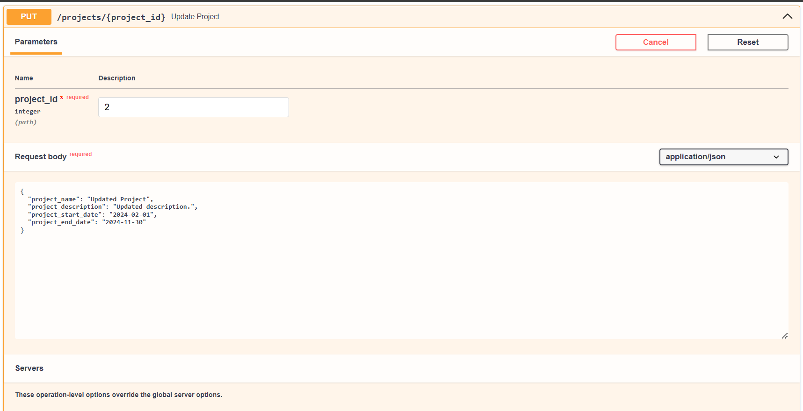

# Project Management System API

## Table of Contents

1. [Overview](#overview)
2. [Key Features](#key-features)
3. [Technologies Used](#technologies-used)
4. [Installation Steps](#installation-steps)
5. [Accessing API Documentation](#accessing-api-documentation)
6. [Running Tests](#running-tests)
7. [API Endpoints](#api-endpoints)
   - [Create Project](#1-create-project)
   - [Get All Projects](#2-get-all-projects)
   - [Get Project by ID](#3-get-project-by-id)
   - [Update Project](#4-update-project)
   - [Delete Project](#5-delete-project)
8. [Python Utility Log](#python-utility-log)
---

## Overview

The **Project Management System API** is a high-performance, scalable RESTful API built with **FastAPI**. It enables seamless management of projects, including the ability to create, read, update, and delete projects while tracking key project attributes like name, start and end dates. The API uses **SQLAlchemy** for database interactions (default is **SQLite**) and **Pydantic** for data validation. This API is designed to be efficient, reliable, and easy to scale.

---

## Key Features

- **Project Management**: Full CRUD operations for projects, including project name, description, start date, and end date.
- **Scalability**: Built with **FastAPI** for fast, asynchronous processing and future extensibility.
- **Data Validation**: Uses **Pydantic** to validate incoming and outgoing data to ensure correctness.
- **Error Handling**: Custom exceptions and general error handling to provide meaningful error messages and responses.
- **API Documentation**: Automatically generated API documentation using **Swagger UI** and **ReDoc UI**.

---

## Technologies Used

- **FastAPI**: A modern web framework for building APIs in Python.
- **SQLAlchemy**: Object-relational mapper (ORM) for database interactions.
- **Pydantic**: Data validation and settings management library.
- **SQLite**: Lightweight, file-based relational database (can be easily swapped for PostgreSQL, MySQL, etc.).
- **Uvicorn**: ASGI server for running the FastAPI app.
- **Python 3.8+**: Python programming language.

---

## Installation Steps

1. **Clone the repository**:

   ```bash
   git clone https://github.com/jeetendra29gupta/project-management-system.git
   cd project-management-system
   ```

2. **Set up a virtual environment**:

   - On **Windows**:
     ```bash
     python -m venv venv
     venv\Scripts\activate
     ```

   - On **macOS/Linux**:
     ```bash
     python -m venv venv
     source venv/bin/activate
     ```

3. **Install dependencies**:

   ```bash
   pip install -r requirements.txt
   ```

4. **Run the application**:

   ```bash
   python main_app.py
   ```

   The app will be accessible at [http://localhost:8181](http://localhost:8181).

---

## Accessing API Documentation

Once the application is running, you can access the interactive API documentation:

- **Swagger UI**: [http://localhost:8181/docs](http://localhost:8181/docs)
  
- **ReDoc UI**: [http://localhost:8181/redoc](http://localhost:8181/redoc)
  

These tools make it easy to test the API endpoints, view models, and explore the available functionality.

---

## Running Tests
- Run the tests:
   ```bash
   pytest
   ```
- Output:
   ```txt
   C:\Users\Admin\Workspace\python_project\.venv\Scripts\python.exe "C:/Program Files/JetBrains/PyCharm Community Edition 2024.2.3/plugins/python-ce/helpers/pycharm/_jb_pytest_runner.py" --path C:\Users\Admin\Workspace\python_project\test_app.py 
    Testing started at 11:44 ...
    Launching pytest with arguments C:\Users\Admin\Workspace\python_project\test_app.py --no-header --no-summary -q in C:\Users\Admin\Workspace\python_project
    
    ============================= test session starts =============================
    collecting ... collected 15 items
    
    test_app.py::test_create_project PASSED                                  [  6%]
    test_app.py::test_create_project_error PASSED                            [ 13%]
    test_app.py::test_create_project_invalid_date_format PASSED              [ 20%]
    test_app.py::test_get_all_projects PASSED                                [ 26%]
    test_app.py::test_get_all_projects_error PASSED                          [ 33%]
    test_app.py::test_get_all_projects_empty_db PASSED                       [ 40%]
    test_app.py::test_get_project_by_id PASSED                               [ 46%]
    test_app.py::test_get_project_by_id_not_found PASSED                     [ 53%]
    test_app.py::test_get_project_by_id_error PASSED                         [ 60%]
    test_app.py::test_update_project PASSED                                  [ 66%]
    test_app.py::test_update_project_not_found PASSED                        [ 73%]
    test_app.py::test_update_project_error PASSED                            [ 80%]
    test_app.py::test_delete_project PASSED                                  [ 86%]
    test_app.py::test_delete_project_not_found PASSED                        [ 93%]
    test_app.py::test_delete_project_error PASSED                            [100%]
    
    ============================= 15 passed in 0.75s ==============================
    
    Process finished with exit code 0
   ```
Tests validate core functionalities, including project creation, retrieval, updates, and deletion.

---

## API Endpoints

### 1. **Create Project**

- **Endpoint**: `POST /projects/`
- **Description**: Create a new project.
- **Request Body**:
  ```json
  {
    "project_name": "New Project",
    "project_description": "Project description here.",
    "project_start_date": "2024-01-01",
    "project_end_date": "2024-12-31"
  }
  ```
- **Response**: 201 Created
  ```json
  {
    "message": "Project created successfully. Project ID: 1.",
    "project": {
      "id": 1,
      "project_name": "New Project",
      "project_description": "Project description here.",
      "project_start_date": "2024-01-01",
      "project_end_date": "2024-12-31",
      "is_active": true,
      "created_at": "2024-11-06T07:23:42",
      "updated_at": "2024-11-06T07:23:42",
      "deleted_at": null
    },
    "date_time": "2024-11-06T12:53:42.141656"
  }
  ```


---

### 2. **Get All Projects**

- **Endpoint**: `GET /projects/`
- **Description**: Retrieve a list of all projects.
- **Response**: 200 OK
  ```json
  {
    "message": "Successfully fetched the list of projects.",
    "projects": [
      {
        "id": 1,
        "project_name": "New Project",
        "project_description": "Project description here.",
        "project_start_date": "2024-01-01",
        "project_end_date": "2024-12-31",
        "is_active": true,
        "created_at": "2024-11-06T07:23:42",
        "updated_at": "2024-11-06T07:23:42",
        "deleted_at": null
      },
      {
        "id": 2,
        "project_name": "New New Project",
        "project_description": "New Project description here.",
        "project_start_date": "2024-02-02",
        "project_end_date": "2025-03-31",
        "is_active": true,
        "created_at": "2024-11-06T07:26:46",
        "updated_at": "2024-11-06T07:26:46",
        "deleted_at": null
      }
    ],
    "date_time": "2024-11-06T12:58:43.160024"
  }
  ```


---

### 3. **Get Project by ID**

- **Endpoint**: `GET /projects/{project_id}`
- **Description**: Retrieve a specific project by its ID.
- **Response**: 200 OK
  ```json
  {
    "message": "Project with ID 1 retrieved successfully.",
    "project": {
      "id": 1,
      "project_name": "New Project",
      "project_description": "Project description here.",
      "project_start_date": "2024-01-01",
      "project_end_date": "2024-12-31",
      "is_active": true,
      "created_at": "2024-11-06T07:23:42",
      "updated_at": "2024-11-06T07:23:42",
      "deleted_at": null
    },
    "date_time": "2024-11-06T13:03:06.069322"
  }
  ```


---

### 4. **Update Project**

- **Endpoint**: `PUT /projects/{project_id}`
- **Description**: Update an existing project.
- **Request Body**:
  ```json
  {
    "project_name": "Updated Project",
    "project_description": "Updated description.",
    "project_start_date": "2024-02-01",
    "project_end_date": "2024-11-30"
  }
  ```
- **Response**: 200 OK
  ```json
  {
    "message": "Project with ID 2 updated successfully.",
    "project": {
      "id": 2,
      "project_name": "Updated Project",
      "project_description": "Updated description.",
      "project_start_date": "2024-02-01",
      "project_end_date": "2024-11-30",
      "is_active": true,
      "created_at": "2024-11-06T07:26:46",
      "updated_at": "2024-11-06T07:36:09",
      "deleted_at": null
    },
    "date_time": "2024-11-06T13:06:09.859837"
  }
  ```


---

### 5. **Delete Project**

- **Endpoint**: `DELETE /projects/{project_id}`
- **Description**: Delete a project by its ID.
- **Response**: 200 OK
  ```json
  {
    "message": "Project with ID 2 deleted successfully.",
    "date_time": "2024-11-06T13:09:09.321878"
  }
  ```


---

## Python Utility Log

This project uses a custom logging utility to capture important runtime information and to rotate log files efficiently.
With this configuration, you will get detailed logs, including error tracking, warnings, and other significant events, helping you troubleshoot and monitor your application effectively.

- Example
   ```bash
    2024-11-06 11:44:25,683 - httpx - INFO - HTTP Request: POST http://testserver/projects/ "HTTP/1.1 201 Created"
    2024-11-06 11:44:25,690 - httpx - INFO - HTTP Request: POST http://testserver/projects/ "HTTP/1.1 422 Unprocessable Entity"
    2024-11-06 11:44:25,697 - httpx - INFO - HTTP Request: POST http://testserver/projects/ "HTTP/1.1 422 Unprocessable Entity"
    2024-11-06 11:44:25,704 - httpx - INFO - HTTP Request: GET http://testserver/projects/ "HTTP/1.1 200 OK"
    2024-11-06 11:44:25,709 - services - ERROR - Error in get_projects_service: Database error
    2024-11-06 11:44:25,710 - httpx - INFO - HTTP Request: GET http://testserver/projects/ "HTTP/1.1 500 Internal Server Error"
    2024-11-06 11:44:25,717 - httpx - INFO - HTTP Request: GET http://testserver/projects/ "HTTP/1.1 200 OK"
    2024-11-06 11:44:25,725 - httpx - INFO - HTTP Request: GET http://testserver/projects/1 "HTTP/1.1 200 OK"
    2024-11-06 11:44:25,733 - httpx - INFO - HTTP Request: GET http://testserver/projects/999 "HTTP/1.1 404 Not Found"
    2024-11-06 11:44:25,739 - services - ERROR - Error in get_project_by_id_service for project ID 1: Database error
    2024-11-06 11:44:25,740 - httpx - INFO - HTTP Request: GET http://testserver/projects/1 "HTTP/1.1 500 Internal Server Error"
    2024-11-06 11:44:25,749 - httpx - INFO - HTTP Request: PUT http://testserver/projects/1 "HTTP/1.1 200 OK"
    2024-11-06 11:44:25,756 - httpx - INFO - HTTP Request: PUT http://testserver/projects/999 "HTTP/1.1 404 Not Found"
    2024-11-06 11:44:25,764 - services - ERROR - Error in get_project_by_id_service for project ID 1: Database error
    2024-11-06 11:44:25,764 - services - ERROR - Error in update_project_service for project ID 1: 500: An unexpected error occurred while fetching the project. Please try again later.
    2024-11-06 11:44:25,765 - httpx - INFO - HTTP Request: PUT http://testserver/projects/1 "HTTP/1.1 500 Internal Server Error"
    2024-11-06 11:44:25,774 - httpx - INFO - HTTP Request: DELETE http://testserver/projects/1 "HTTP/1.1 200 OK"
    2024-11-06 11:44:25,782 - httpx - INFO - HTTP Request: DELETE http://testserver/projects/999 "HTTP/1.1 404 Not Found"
    2024-11-06 11:44:25,788 - services - ERROR - Error in get_project_by_id_service for project ID 1: Database error
    2024-11-06 11:44:25,788 - services - ERROR - Error in delete_project_service for project ID 1: 500: An unexpected error occurred while fetching the project. Please try again later.
    2024-11-06 11:44:25,789 - httpx - INFO - HTTP Request: DELETE http://testserver/projects/1 "HTTP/1.1 500 Internal Server Error"
   ```
  
---